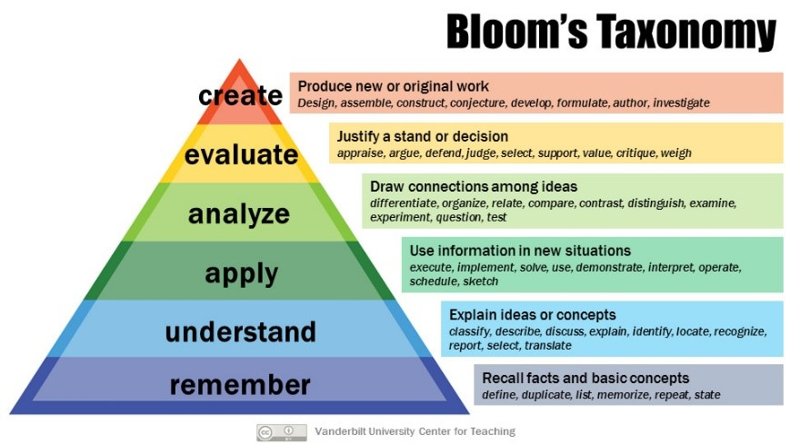

# Preface {.unnumbered}

```{r}
#| label: vars
#| echo: false
url_av <- "https://aulavirtual.uji.es/course/view.php?id=87296"
url_sia_39 <- "https://ujiapps.uji.es/sia/rest/publicacion/2026/estudio/225/asignatura/EI1039"
url_sia_48 <- "https://ujiapps.uji.es/sia/rest/publicacion/2026/estudio/225/asignatura/EI1048"

```

## Objetivo y resultados de aprendizaje

Según el [SIA](`r url_sia_39``),

> "la asignatura Diseño de Software se imparte en el primer semestre de cuarto curso del grado en Ingeniería Informática de la Universitat Jaume I, como parte del itinerario de Ingeniería del Software.  [...] El objetivo de esta asignatura es proporcionar al alumnado conocimientos y habilidades sobre cómo resolver los **problemas de diseño de software** más comunes aplicando **soluciones** estandarizadas y eficientes, conocidas como **patrones** de diseño patrones de arquitectura."

- ¿De qué *problemas* estamos hablando?

- ¿De qué *soluciones estandarizadas y eficientes* estamos hablando?


Tan importantes, o incluso más, que los conocimientos y habilidades que aprenderás en esta asignatura son las competencias blandas o habilidades interpersonales (*soft skills*), como la comunicación, el trabajo en equipo, la síntesis de información, la toma de decisiones, la resolución de conflictos, la gestión del tiempo, y el liderazgo. Trabajaremos en estas competencias o habilidades a lo largo del curso porque, aunque parezca increíble, son aspectos vitales del día a día de un arquitecto/a,  diseñador/a o analista de software.

Arquitectura de software, patrones de diseño, patrones de arquitectura de datos, comunicación, trabajo en equipo, .... Suena bien, ¿no? Espero que encuentres atractivo e interesante el contenido de la asignatura a lo largo del semestre.

## Método de instrucción

Hay evidencia científica de sobra que demuestra una y otra vez que los métodos de *aprendizaje activo* (por *activo* me refiero a todos, tanto dentro como fuera de clase) son mucho más efectivos que escucharme y tomar apuntes de forma pasiva. Vale, es cierto que a veces son necesarias presentaciones aclaratorias; pero tú debes ser el protagonista de tu proceso de aprendizaje para alcanzar los resultados esperados con éxito. Y yo estoy encantado de facilitar ese proceso de aprendizaje. 

::: {.callout-tip icon=true}
## ¿Te has preguntado alguna vez qué pasa en tu cerebro cuando aprendes? [@lang2016]

Tenemos millones de neuronas que "hacen amigos fácilmente". Las neuronas se conectan con otras neuronas formando redes con cada nueva experiencia que tenemos (nuevas emociones, pensamientos, acciones, conocimiento, etc.). Las redes al principio son débiles, pero cada vez que repetimos la experiencia o acción, el camimo de la red se consolida y se hace más fuerte. **Cuando aprendemos, nuestro cerebro cambia** por la formación de nuevas conexiones entre neuronas.

¿Quieres saber más? [10 Things Software Developers Should Learn about Learning](https://cacm.acm.org/research/10-things-software-developers-should-learn-about-learning/) [@brown2023]
:::


Esta asignatura mezcla diversas estrategias de aprendizaje, algunas más tradicionales como presentaciones cuando sea necesario combinadas con estrategias de apredizaje colaborativas y activas para trabajo en grupo, exploración y aplicación de conceptos, y competencias de proceso (o [process skills](http://elipss.com/process-skills.html)), como por ejemplo [*Flipped Classroom*](https://www.theflippedclassroom.es/) (lecturas y ejercicios básicos fuera del aula que requieren competencias cognitivas bajas, con análisis y resolución de problemas en aula que requiren competencias cognitivas altas).


::: {.callout-tip icon=true}
## Pirámide Bloom

Cuando **reflexionamos** y **aplicamos** cierto conocimiento a contextos nuevos (en contraposición a simplemente leer o subrayar, ver @fig-bloom), lo comprendemos más profundamente, provocando que la red (de neuronas) sea más densa y tenga conexiones con otras redes, con lo cual estamos mejorando nuestro aprendizaje. La diferencia entre la red de un principiante y la de un experto radica justamente en el número y densidad de conexiones. **Cuanto más interconexiones, mayor comprensión**.

{#fig-bloom width="60%"}
:::


Para que te hagas una idea, una semana típica de clase de teoría/seminario sería así:

- En el AV se indica el trabajo (lecturas recomendadas, etc) que cada estudiante debe realizar previo a la sesión de teoría.

- Durante la sesión en aula (viernes) profundizaremos en esos contenidos mediante presentaciones y actividades en clase.


Además, las asignaturas [EI1039 (Diseño de Software)](`r url_sia_39`) y [EI1048 (Paradigmas de Software)](`r url_sia_48``) están muy relacionadas, ya que son dos caras de la misma moneda a la hora de diseñar y desarrollar aplicaciones avanzadas. Para facilitar el aprendizaje de las competencias y conenbido de ambas asignaturas, el profesorado nos hemos organizado y coordinado para proponerte un proyecto común que viene detallado en un documento separado colgado en el AV de ambas asignaturas. Las sesiones de laboratorio (LA) de las dos asignaturas se destinan integramente al trabajo (en grupo) para el desarrollo del proyecto común.

Llevamos varios años colaborando entre el profesorado de ambas asignaturas y presentando los resultados en foros sobre educación universitaria en informática (e.g., [JENUI](https://aenui.org/jenui/)): 

- [@gonzalez2021jenui], 

- [@gonzalez2022jenui], 

- [@matey2024jenui],  

- [@matey2025jenui], y

- [@matey2026ieee].


La asignatura también consta de 5 sesiones de seminarios (SE), en el aula [TD1102AA](https://www.uji.es/u/TD1102AA), donde exploraremos temas adicionales al diseño de software pero que están relacionados de algún modo con el proyecto común a desarrollar. La información de los seminarios se encuentra únicamente en el AV. 

- **Seminario 1** (*18 septiembre*) sobre patrones de interfaces de usuarios (MVC y variantes) + LLMs.

- **Seminario 2** (*2 octubre*) sobre patrones de arquitectura mediante un caso de estudio.

- **Seminario 3** (*23 octubre*) y **Seminario 4** (*20 noviembre*) se realizan conjuntamente con el profesorado de la EI1048. Presentación grupal del estado del proyecto común y discusión con el profesorado.

- **Seminario 5** (*4 diciembre*) sobre comunicación oral efectiva (a las 15:00!).


## Materiales y contenido

Los materiales del curso relativos a Teoria (TE) están disponibles en el [Aula Virtual](`r url_av`), organizados por semanas. Obviamente, el AV enlaza con este sitio web de la asignatura. Es por tanto conveniente tener ambos abiertos.  


## Métodos de evaluación

El desarrollo, entrega y defensa del proyecto común representa el 70% de la nota final para ambas asignaturas. Además, vuestra participación en clase es fundamental. Las actividades propuestas en el aula durante las sesiones de teoría y/o seminarios invitan al trabajo colaborativo y participativo, fomentado el aprendizaje activo, la discusión y la comunicación. Los seminarios computan un 20% de la nota final, según se desglosa en @tbl-evaluacion. A lo largo del curso se informará con más detalle de la naturaleza de los seminarios evaluables. Por último, un examen escrito (individual) de tipo *quiz* evaluará lo aprendido en las sesiones de teoría.


| Actividad | Carácter | Peso | Tipo             | Instrumento  |
|-----------|------|---------------|---------------|---------------|
| Seminarios 1 y 2  | Individual | 10%  | Formativa    | Reflexión personal |
| Seminarios 3 y 4 (con EI1048) | Grupo      | 10%  | Formativa    | Presentación y discusión   |
| Proyecto común (con EI1048)   | Grupo      | 70%  | Acreditativa | Código, documento escrito, presentación y discusión |
| Examen            | Individual | 10%  | Acreditativa    | examen escrito |

: Instrumentos de evaluación {#tbl-evaluacion} {.hover}

