# Patrones de diseño

## ¿Qué es un patrón?

El término **patrón** tiene multiples significados según el contexto: patrones numéricos, patrones geométricos, etc. 

En informática, el área de [aprendizaje automático](https://es.wikipedia.org/wiki/Aprendizaje_autom%C3%A1tico) utiliza técnicas computacionales avanzadas para buscar y encontrar patrones en los datos. 

En ingeniería de software, descubrirás a lo largo de tu carrera profesional que los mismos problemas de diseño de software se repiten una y otra vez. Hay muchas formas de abordar estos problemas, pero la industria prefiere soluciones más flexibles y/o reutilizables. Ahí es donde los **patrones de diseño** entran en juego.

::: {.callout-note icon=true}
## Definición

Un **patrón de diseño de software** es una solución práctica, reutilizable y bien testeada a problemas recurrentes.
:::

Los patrones de diseño permiten (re)utilizar soluciones previamente testeadas que los desarrolladores han utilizado a menudo para resolver un problema de diseño de software, de modo que no es necesario reinvoitar la rueda, es decir, crear una *nueva* solución a partir de los principios básicos de la programación orientada a objetos. Los patrones de diseño no son solo soluciones teóricas o académicas, son soluciones reales que se utilizan en la industria del software, por ejemplo, en la implementación de los propios lenguajes de progrmación o en productos software comerciales. 

Una buena analogía para entender el concepto de patrones de diseño es equipararlos a *planos predefinidos* que se pueden personalizar para resolver un problema de diseño recurrente en tu código.

::: {.column-margin}

{fig-alt="house-layout" fig-align="center" width="70%"}

*Source: [Rawpixel.com](https://www.rawpixel.com/image/691263/)*

:::

Es importante dejar claro que los patrones de diseño no son únicamente código (clases, interfaces, etc) que se añaden a tu proyecto de software. Los patrones de diseño se deben consider como **soluciones conceptuales**: soluciones que se pueden aplicar y, sobre todo personalizar, edurante el diseño e impleemntación de software en contextos concretos para mejorar la estructura, modularidad, abstracción, flexibilidad y reutilización de tu código. Por ese motivo, en este curso describimos los patrones de diseño de forma conceptual (clases, interfaces, relaciones, etc.); obviamente, implementarás patrones de diseño concretos en el contexto del proyecto común.

::: {.callout-tip}
## Slide Deck 

::: slides
[Patrones de Diseño: Concepto, catálogo y principios](https://cgranell.github.io/ei1039-uji/materials/02-patrones-slides.html)
:::

:::

## Principios SOLID

Varios autores ([Michael Feathers](https://michaelfeathers.silvrback.com/), [Robert C. Martin](https://blog.cleancoder.com/), etc. ) han contribuido a definir una serie de principios (recomendaciones, etc.) para que desarrolladores/programadores generen software de *calidad*. ¿Y qué entendemos por software de calidad? Software que sea  

- robusto y estable, 
- reutilizable y mantenible, 
- escalable, es decir, que se pueda modificar/extender fácilmente.

Sin embargo, que el código resultante sea robusto y estable por un lado, pero que también sea fácilmente extendible y reutilizable por otro, parece que sean objetivos contradictorios. En ingeniería y desarrollo de software, tenemos dos conceptos que tenemos que balancear adecuadamente al mismo tiempo para producir software de calidad.

::: {.callout-note icon=true}
## Definición

**Acoplamiento** indica el grado de *interdependencia* entre entidades/componentes de software (ya sean clases, métodos, módulos, funciones, etc. ). Si dos componentes son completamente independientes entre sí, entonces están *desacoplados*.

:::

Como ingenieros/as de software, queremos que el software generado tenga **un bajo acomplamiento**.

::: {.callout-note icon=true}
## Definición

**Cohesión** indica el grado en que entidades/componentes de software independientes se combinan para alcanzar un resultado (comporatemeionte, etc) mejor que si trabajaran por separado. Se refiere a la forma en que podemos agrupar componentes de software.

:::

Como ingenieros/as de software, queremos que el software generado tenga **una alta cohesión**.

Los principios SOLID están estrechamente relacionados con el uso de patrones de diseño, ya que las solucciones conceptuales de muchos patrones apuntan directamente a uno o varios de los principios SOLID. Luego, cuando utilizas patrones de diseño de forma eficaz, estarás poniendo en práctica alguno de los principios SOLID para que el código resultante sea de la mejor calidad posible. 

Los 5 principios SOLID de diseño de aplicaciones de software son:

- **S** – Single Responsibility Principle (SRP)
- **O** – Open/Closed Principle (OCP)
- **L** – Liskov Substitution Principle (LSP)
- **I** – Interface Segregation Principle (ISP)
- **D** – Dependency Inversion Principle (DIP)

::: {.callout-tip}
## Slide Deck 

::: slides
[Principios SOLID](https://cgranell.github.io/ei1039-uji/materials/02-solid-slides.html)
:::

:::

## Patrones creacionales

::: {.callout-note icon=true}
## Definición

Los **patrones creacionales** proporcionan mecanismos de creación de objetos que incrementan la flexibilidad y la reutilización del código.

:::

Las secciones relativas a los patrones creacionales (y los estructurales y de comportamiento) se dividen en los mismos apartados, tal como reflejan los mapas conceptuales:

1. Propósito (*aim*)

2. Problema (*what problem does it solve?*)

3. Solución (*conceptual solution*)

4. Ventajas e inconvenientes (*pros and cons*)

Además, cada mapa conceptual añade tres apartados más:

5. A menudo se confunde con (*often confused with*)

6. Ver también (*see also*)

7. Usos (*usage*)

Dejamos para la argumentación y discusión en clase la tarea de [conectar y relacionar](#relaciones-entre-patrones) los distintos patrones creacionales entre ellos, y sugerir [situaciones o aplicaciones](#aplicabilidad) donde se puedan aplicar.

### Singleton

| Propósito |  Problema |
|-----------|-----------|
| asegura que una clase tenga una **única instancia** y proporciona un punto de **acceso global** a dicha instancia | ... porque quiero centralizar o controlar el acceso a un recurso. |

::: column-screen-inset-right

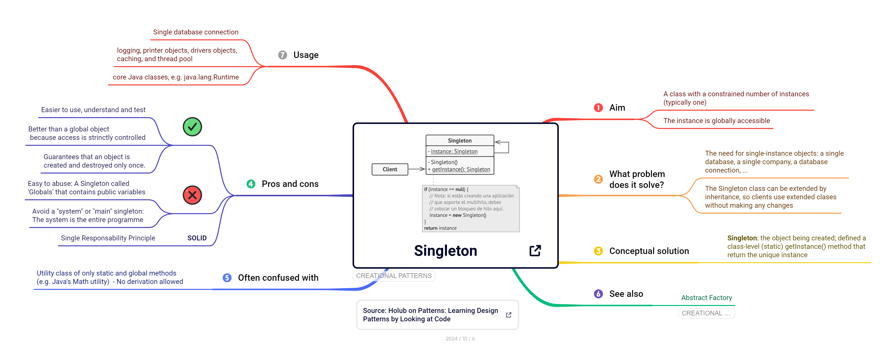

:::

::: {.callout-tip}
## Implementación

{width=25} [Singleton en Java (refactoring.guru)](https://refactoring.guru/es/design-patterns/singleton/java/example#lang-features)

:::

### Factory method

| Propósito |  Problema |
|-----------|-----------|
| crea objetos **sin especificar las clases concretas** | ... porque quiero crear objetos especializados  en tiempo de ejecución |

::: column-screen-inset-right
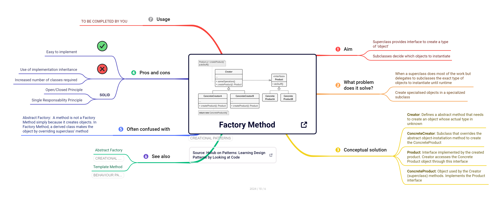
:::

::: {.callout-tip}
## Slide Deck 

::: slides
[Factory objects & Factory Method pattern](https://cgranell.github.io/ei1039/slides/TE3_factory.html)
:::

:::

::: {.callout-tip}
## Implementación

{width=25} [Factory Method en Java (refactoring.guru)](https://refactoring.guru/es/design-patterns/factory-method/java/example#lang-features)

:::

### Abstract Factory

| Propósito |  Problema |
|-----------|-----------|
| **agrupa factorias** relacionadas temáticamente sin especificar las clases concretas | ... porque quiero crear familias de objetos especializados en tiempo de ejecución |

::: column-screen-inset-right
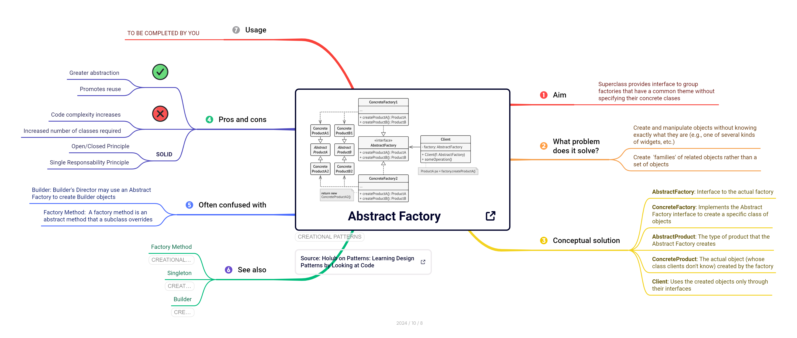
:::

::: {.callout-tip}
## Implementación

{width=25} [Abstract Factory en Java (refactoring.guru)](https://refactoring.guru/es/design-patterns/abstract-factory/java/example#lang-features)

:::

### Builder

| Propósito |  Problema |
|-----------|-----------|
| crea objetos complejos separando el proceso de **construcción de su representación** | ... porque tengo clases constructuras con muchos argumentos |

::: column-screen-inset-right
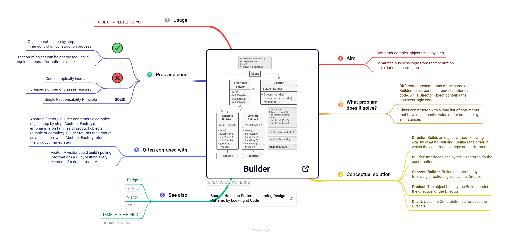
:::

::: {.callout-tip}
## Implementación

{width=25} [Builder en Java (refactoring.guru)](https://refactoring.guru/es/design-patterns/builder/java/example#lang-features)

:::

### Prototype

### Relaciones entre patrones

### Aplicabilidad

## Patrones estructurales

::: {.callout-note icon=true}
## Definición

Los **patrones estructurales** se refieren a la organización del código, es decir, a la composición de clases y objetos. Definen formas de componer y organizar clases para obtener fines estructurales (nuevas funciones, etc.).

:::

### Adapter

| Propósito |  Problema |
|-----------|-----------|
| permite que clases con **interfaces incompatibles** colaboren...  | ... porque quiero utilizar cierta clase o librería externa |

::: column-screen-inset-right

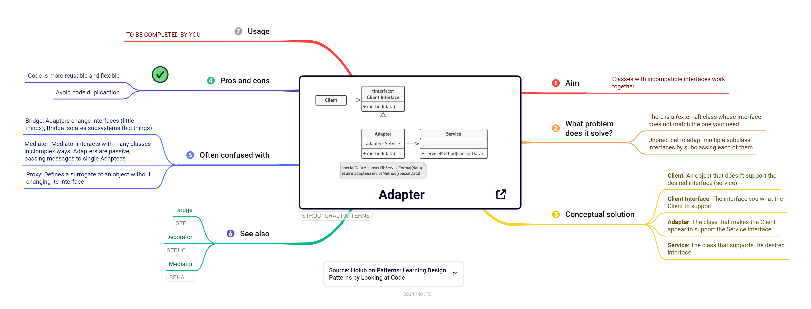

:::

::: {.callout-tip}
## Slide Deck 

::: slides
[Adapter pattern ](https://cgranell.github.io/ei1039/slides/TE5_adapter.html)
:::

:::

::: {.callout-tip}
## Implementación

{width=25} [Adapter en Java (refactoring.guru)](https://refactoring.guru/es/design-patterns/adapter/java/example#lang-features)

:::

### Bridge

| Propósito |  Problema |
|-----------|-----------|
| **separa subsistemas**... | ... porque puede que un subsistema cambie completamente sin que eso afecte al otro subsistema |

::: column-screen-inset-right

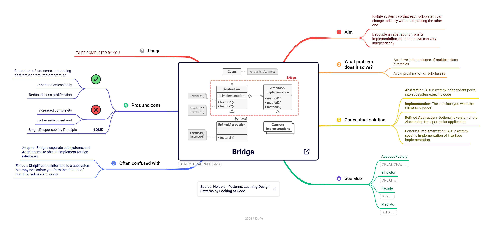

:::

::: {.callout-tip icon=false}
## Implementación

{width=25} [Bridge en Java (refactoring.guru)](https://refactoring.guru/es/design-patterns/bridge/java/example#lang-features)

:::

### Facade 

| Propósito |  Problema |
|-----------|-----------|
| **simplifica la interfaz** a un subsistema... | ... porque quiero ocultar la complejidad de un subsistema a los clientes |

::: column-screen-inset-right

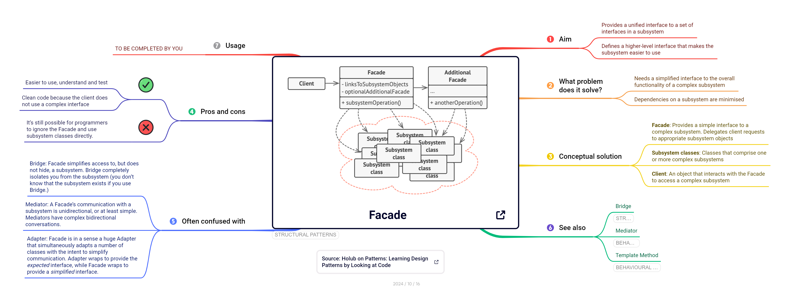

:::

::: {.callout-tip}
## Slide Deck 

[Facade pattern](https://cgranell.github.io/ei1039/slides/TE5_facade.html)

:::

::: {.callout-tip}
## Implementación

{width=25} [Facade en Java (refactoring.guru)](https://refactoring.guru/es/design-patterns/facade/java/example#lang-features)

:::

### Proxy

| Propósito |  Problema |
|-----------|-----------|
| **suplanta** recursos reales de forma transparente al cliente... | ... porque quiero implantar restricciones de acceso o reducir coste |

::: column-screen-inset-right

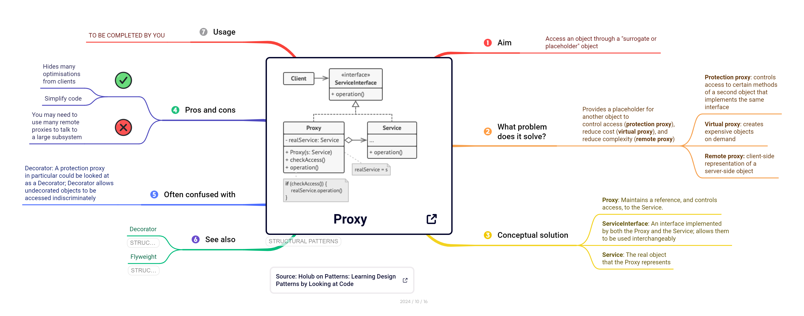

:::

::: {.callout-tip}
## Slide Deck

[Proxy pattern](https://cgranell.github.io/ei1039/slides/TE5_proxy.html)

:::

::: {.callout-tip}
## Implementación

{width=25} [Proxy en Java (refactoring.guru)](https://refactoring.guru/es/design-patterns/proxy/java/example#lang-features)

:::

### Composite

| Propósito |  Problema |
|-----------|-----------|
| **manipula** jerarquías de objetos somo si fueran de solo un tipo ... | ... porque quiero tratar objetos individuales y compuestos de la misma forma |

::: column-screen-inset-right

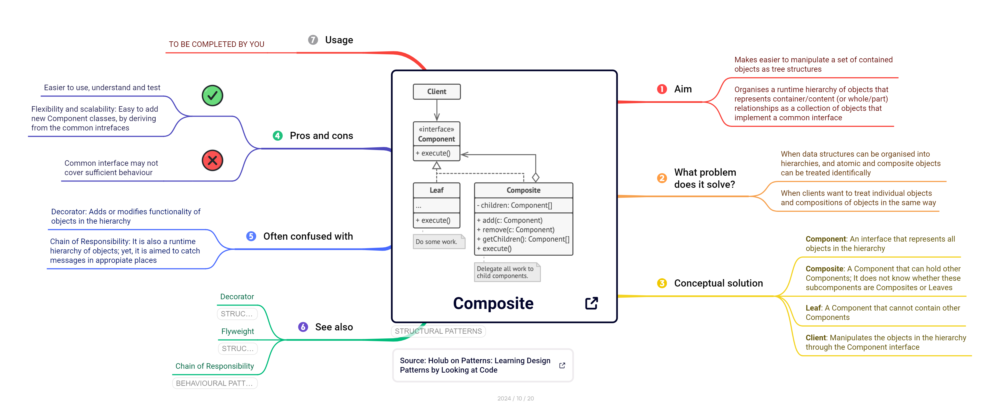

:::

::: {.callout-tip}
## Slide Deck

[Composite pattern](https://cgranell.github.io/ei1039/slides/TE6_composite.html)

:::

::: {.callout-tip}
## Implementación

{width=25} [Composite en Java (refactoring.guru)](https://refactoring.guru/es/design-patterns/composite/java/example#lang-features)

:::

### Decorator

| Propósito |  Problema |
|-----------|-----------|
| **añade** nuevas reponsabilidades/comportamientos a objetos | ... porque quiero añadirlos, quitarlos, o agregarlos dinámicamente |

::: column-screen-inset-right

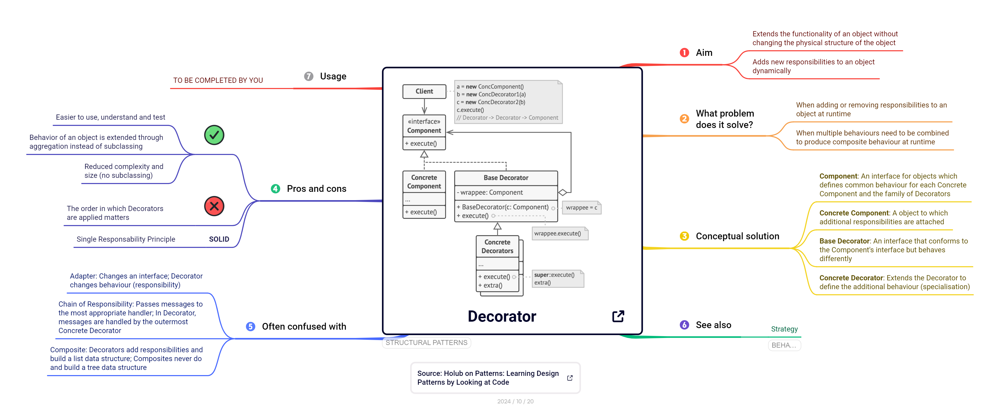

:::

::: {.callout-tip}
## Slide Deck 

[Decorator pattern](https://cgranell.github.io/ei1039/slides/TE6_decorator.html)

:::

::: {.callout-tip}
## Implementación

{width=25} [Decorator en Java (refactoring.guru)](https://refactoring.guru/es/design-patterns/composite/java/example#lang-features)

:::

### Flyweight
 

| Propósito |  Problema |
|-----------|-----------|
| **construye objetos ligeros**  que comparten estado... | ... porque tengo problemas de memoria al tener muchos objetos similares |

::: column-screen-inset-right

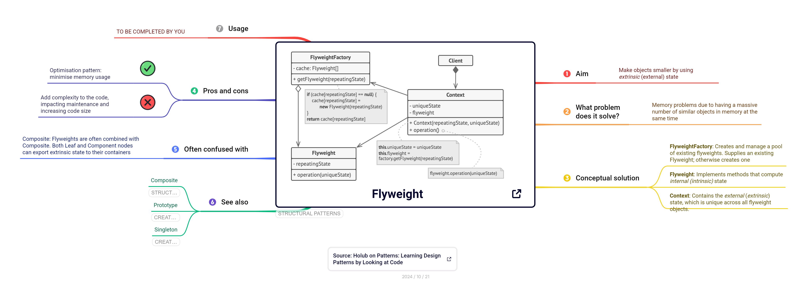
:::

::: {.callout-tip}
## Implementación

{width=25} [Flyweight en Java (refactoring.guru)](https://refactoring.guru/es/design-patterns/flyweight/java/example#lang-features)

:::
 
 
 
### Relaciones entre patrones

### Aplicabilidad

