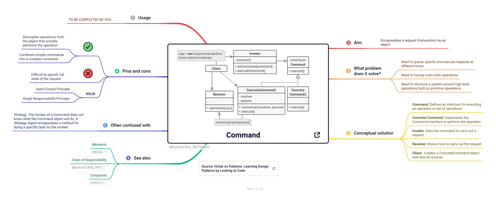
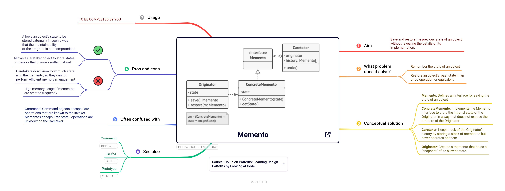
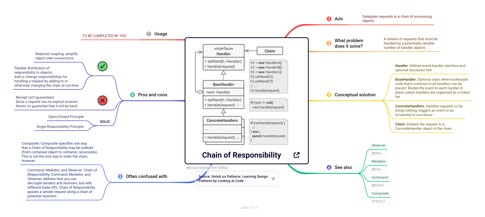
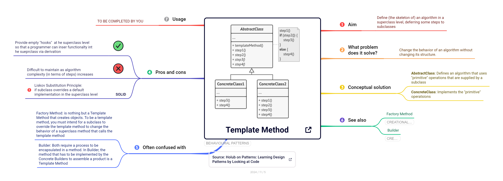
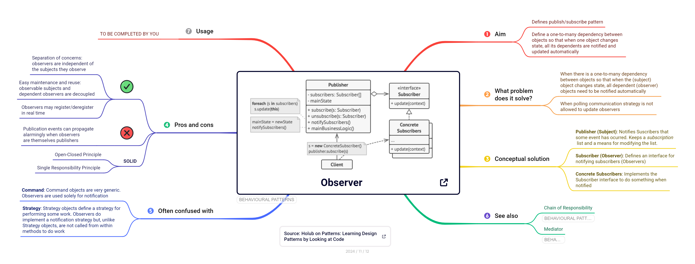
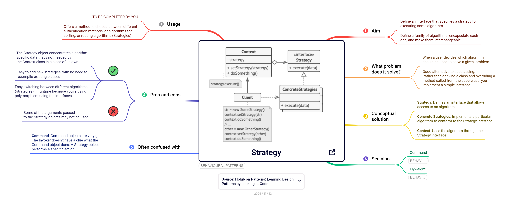
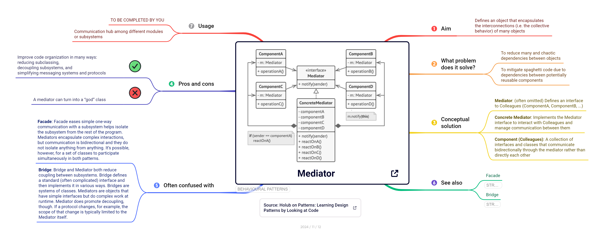
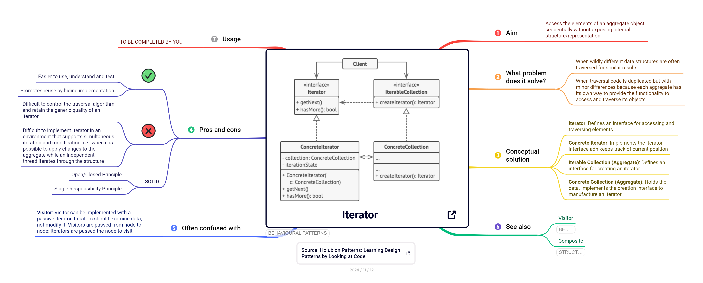

# Patrones de diseño

## ¿Qué es un patrón?

El término **patrón** tiene multiples significados según el contexto: patrones numéricos, patrones geométricos, etc. 

En informática, el área de [aprendizaje automático](https://es.wikipedia.org/wiki/Aprendizaje_autom%C3%A1tico) utiliza técnicas computacionales avanzadas para buscar y encontrar patrones en los datos. 

En ingeniería de software, descubrirás a lo largo de tu carrera profesional que los mismos problemas de diseño de software se repiten una y otra vez. Hay muchas formas de abordar estos problemas, pero la industria prefiere soluciones más flexibles y/o reutilizables. Ahí es donde los **patrones de diseño** entran en juego.

::: {.callout-note title="Definición" icon=true}

Un **patrón de diseño de software** es una solución práctica, reutilizable y bien testeada a problemas recurrentes.
:::

Los patrones de diseño permiten (re)utilizar soluciones previamente testeadas que los desarrolladores han utilizado a menudo para resolver un problema de diseño de software, de modo que no es necesario reinvoitar la rueda, es decir, crear una *nueva* solución a partir de los principios básicos de la programación orientada a objetos. Los patrones de diseño no son solo soluciones teóricas o académicas, son soluciones reales que se utilizan en la industria del software, por ejemplo, en la implementación de los propios lenguajes de progrmación o en productos software comerciales. 

Una buena analogía para entender el concepto de patrones de diseño es equipararlos a *planos predefinidos* que se pueden personalizar para resolver un problema de diseño recurrente en tu código.

::: {.column-margin}

{fig-alt="house-layout" fig-align="center" width="70%"}

*Source: [Rawpixel.com](https://www.rawpixel.com/image/691263/)*

:::

Es importante dejar claro que los patrones de diseño no son únicamente código (clases, interfaces, etc) que se añaden a tu proyecto de software. Los patrones de diseño se deben consider como **soluciones conceptuales**: soluciones que se pueden aplicar y, sobre todo personalizar, edurante el diseño e impleemntación de software en contextos concretos para mejorar la estructura, modularidad, abstracción, flexibilidad y reutilización de tu código. Por ese motivo, en este curso describimos los patrones de diseño de forma conceptual (clases, interfaces, relaciones, etc.); obviamente, implementarás patrones de diseño concretos en el contexto del proyecto común.

## Patrones creacionales

::: {.callout-note title="Definición" icon=true}

Los **patrones creacionales** proporcionan mecanismos de creación de objetos que incrementan la flexibilidad y la reutilización del código.

:::

Las secciones relativas a los patrones creacionales (y los estructurales y de comportamiento) se dividen en los mismos apartados, tal como reflejan los mapas conceptuales:

1. Propósito (*aim*)

2. Problema (*what problem does it solve?*)

3. Solución (*conceptual solution*)

4. Ventajas e inconvenientes (*pros and cons*)

Además, cada mapa conceptual añade tres apartados más:

5. A menudo se confunde con (*often confused with*)

6. Ver también (*see also*)

7. Usos (*usage*)

Dejamos para la argumentación y discusión en clase la tarea de [conectar y relacionar](#relaciones-entre-patrones) los distintos patrones creacionales entre ellos, y sugerir [situaciones o aplicaciones](#aplicabilidad) donde se puedan aplicar.

### Singleton

| Propósito |  Problema |
|-----------|-----------|
| asegura que una clase tenga una **única instancia** y proporciona un punto de **acceso global** a dicha instancia | ... porque quiero centralizar o controlar el acceso a un recurso. |

::: column-screen-inset-right

:::

::: {.callout-tip title="Implementación"}

{width=25} [Singleton en Java (refactoring.guru)](https://refactoring.guru/es/design-patterns/singleton/java/example#lang-features)

:::

### Factory method

| Propósito |  Problema |
|-----------|-----------|
| crea objetos **sin especificar las clases concretas** | ... porque quiero crear objetos especializados  en tiempo de ejecución |

::: column-screen-inset-right

:::

::: {.callout-tip title="Slide Deck"}

[Factory objects & Factory Method pattern](https://cgranell.github.io/ei1039/slides/TE3_factory.html)

:::

::: {.callout-tip title="Implementación"}

{width=25} [Factory Method en Java (refactoring.guru)](https://refactoring.guru/es/design-patterns/factory-method/java/example#lang-features)

:::

### Abstract Factory

| Propósito |  Problema |
|-----------|-----------|
| **agrupa factorias** relacionadas temáticamente sin especificar las clases concretas | ... porque quiero crear familias de objetos especializados en tiempo de ejecución |

::: column-screen-inset-right

:::

::: {.callout-tip title="Implementación"}

{width=25} [Abstract Factory en Java (refactoring.guru)](https://refactoring.guru/es/design-patterns/abstract-factory/java/example#lang-features)

:::

### Builder

| Propósito |  Problema |
|-----------|-----------|
| crea objetos complejos separando el proceso de **construcción de su representación** | ... porque tengo clases constructuras con muchos argumentos |

::: column-screen-inset-right

:::

::: {.callout-tip title="Implementación"}

{width=25} [Builder en Java (refactoring.guru)](https://refactoring.guru/es/design-patterns/builder/java/example#lang-features)

:::

### Prototype

### Relaciones entre patrones

### Aplicabilidad

## Patrones estructurales

::: {.callout-note title="Definición" icon=true}

Los **patrones estructurales** se refieren a la organización del código, es decir, a la composición de clases y objetos. Definen formas de componer y organizar clases para obtener fines estructurales (nuevas funciones, etc.).

:::

### Adapter

| Propósito |  Problema |
|-----------|-----------|
| permite que clases con **interfaces incompatibles** colaboren...  | ... porque quiero utilizar cierta clase o librería externa |

::: column-screen-inset-right

:::

::: {.callout-tip title="Slide Deck"}

[Adapter pattern ](https://cgranell.github.io/ei1039/slides/TE5_adapter.html)

:::

::: {.callout-tip title="Implementación"}

{width=25} [Adapter en Java (refactoring.guru)](https://refactoring.guru/es/design-patterns/adapter/java/example#lang-features)

:::

### Bridge

| Propósito |  Problema |
|-----------|-----------|
| **separa subsistemas**... | ... porque puede que un subsistema cambie completamente sin que eso afecte al otro subsistema |

::: column-screen-inset-right

:::

::: {.callout-tip title="Implementación"}

{width=25} [Bridge en Java (refactoring.guru)](https://refactoring.guru/es/design-patterns/bridge/java/example#lang-features)

:::

### Facade 

| Propósito |  Problema |
|-----------|-----------|
| **simplifica la interfaz** a un subsistema... | ... porque quiero ocultar la complejidad de un subsistema a los clientes |

::: column-screen-inset-right

:::

::: {.callout-tip title="Slide Deck"}

[Facade pattern](https://cgranell.github.io/ei1039/slides/TE5_facade.html)

:::

::: {.callout-tip title="Implementación"}

{width=25} [Facade en Java (refactoring.guru)](https://refactoring.guru/es/design-patterns/facade/java/example#lang-features)

:::

### Proxy

| Propósito |  Problema |
|-----------|-----------|
| **suplanta** recursos reales de forma transparente al cliente... | ... porque quiero implantar restricciones de acceso o reducir coste |

::: column-screen-inset-right

:::

::: {.callout-tip title="Slide Deck"}

[Proxy pattern](https://cgranell.github.io/ei1039/slides/TE5_proxy.html)

:::

::: {.callout-tip title="Implementación"}

{width=25} [Proxy en Java (refactoring.guru)](https://refactoring.guru/es/design-patterns/proxy/java/example#lang-features)

:::

### Composite

| Propósito |  Problema |
|-----------|-----------|
| **manipula** jerarquías de objetos somo si fueran de solo un tipo ... | ... porque quiero tratar objetos individuales y compuestos de la misma forma |

::: column-screen-inset-right

:::

::: {.callout-tip title="Slide Deck"}

[Composite pattern](https://cgranell.github.io/ei1039/slides/TE6_composite.html)

:::

::: {.callout-tip title="Implementación"}

{width=25} [Composite en Java (refactoring.guru)](https://refactoring.guru/es/design-patterns/composite/java/example#lang-features)

:::

### Decorator

| Propósito |  Problema |
|-----------|-----------|
| **añade** nuevas reponsabilidades/comportamientos a objetos | ... porque quiero añadirlos, quitarlos, o agregarlos dinámicamente |

::: column-screen-inset-right

:::

::: {.callout-tip title="Slide Deck"}

[Decorator pattern](https://cgranell.github.io/ei1039/slides/TE6_decorator.html)

:::

::: {.callout-tip title="Implementación"}

{width=25} [Decorator en Java (refactoring.guru)](https://refactoring.guru/es/design-patterns/composite/java/example#lang-features)

:::

### Flyweight
 

| Propósito |  Problema |
|-----------|-----------|
| **construye objetos ligeros**  que comparten estado... | ... porque tengo problemas de memoria al tener muchos objetos similares |

::: column-screen-inset-right

:::

::: {.callout-tip title="Implementación"}

{width=25} [Flyweight en Java (refactoring.guru)](https://refactoring.guru/es/design-patterns/flyweight/java/example#lang-features)

:::
 
 
 
### Relaciones entre patrones

### Aplicabilidad

## Patrones de comportamiento

::: {.callout-note title="Definición" icon=true}

Los **patrones de comportamiento** se refieren a la comunicación entre objetos en tiempo de ejecución, es decir, los roles que asumen dichos objetos y cómo interactúan entre sí.

:::

### Command

| Propósito |  Problema |
|-----------|-----------|
| permite encapsular una petición como un objeto ...  | ... porque quiero tener mayor control sobre el ciclo de vida de dicha petición |

::: column-screen-inset-right

:::

::: {.callout-tip title="Slide Deck" icon=false}

[Command pattern](https://cgranell.github.io/ei1039/slides/TE8_command.html)

:::

::: {.callout-tip title="Implementación"}

{width=25} [Command en Java (refactoring.guru)](https://refactoring.guru/es/design-patterns/command/java/example#lang-features)

:::

### Memento

| Propósito |  Problema |
|-----------|-----------|
| permite capturar el estado de un objeto  ...  | ... porque quiero restaurar ese estado en cualquier momento |

::: column-screen-inset-right

:::

::: {.callout-tip title="Implementación"}

{width=25} [Memento en Java (refactoring.guru)](https://refactoring.guru/es/design-patterns/memento/java/example#lang-features)

:::

### Chain of responsibility

| Propósito |  Problema |
|-----------|-----------|
| permite distribuir responsabilidad de una petición ...  | ... porque tengo un número variable de objetos que pueden gestionarla |

::: column-screen-inset-right

:::

::: {.callout-tip title="Implementación"}

{width=25} [Chain of Reponsibility en Java (refactoring.guru)](https://refactoring.guru/es/design-patterns/chain-of-responsibility/java/example#lang-features)

:::

### Template method  

| Propósito |  Problema |
|-----------|-----------|
| define un algoritmo a nivel de superclase...  | ... pero permite que subclases sobrescriban partes del algoritmo |

::: column-screen-inset-right

:::

::: {.callout-tip title="Slide Deck"}

[Template Method pattern](https://cgranell.github.io/ei1039/slides/TE7_templatemethod.html)

:::

::: {.callout-tip title="Implementación"}

{width=25} [Template Method en Java (refactoring.guru)](https://refactoring.guru/es/design-patterns/template-method/java/example#lang-features)

:::

### Observer

| Propósito |  Problema |
|-----------|-----------|
| define un mecanismo de suscripción sobre un objeto (sujeto) ...  | ... porque hay un número variable de objetos observadores que dependen de sus cambios |

::: column-screen-inset-right

:::

::: {.callout-tip title="Slide Deck"}

[Observer pattern](https://cgranell.github.io/ei1039/slides/TE6_observer.html)

:::

::: {.callout-tip title="Implementación"}

{width=25} [Observer en Java (refactoring.guru)](https://refactoring.guru/es/design-patterns/observer/java/example#lang-features)

:::

### Strategy

| Propósito |  Problema |
|-----------|-----------|
| Permite seleccionar un método/algoritmo en tiempo real ...  | ... porque hay diferentes algoritmos intercambiables para resolver un mismo problema |

::: column-screen-inset-right

:::

::: {.callout-tip title="Slide Deck"}

[Strategy pattern](https://cgranell.github.io/ei1039/slides/TE7_strategy.html)

:::

::: {.callout-tip title="Implementación"}

{width=25} [Strategy en Java (refactoring.guru)](https://refactoring.guru/es/design-patterns/strategy/java/example#lang-features)

:::

### Mediator

| Propósito |  Problema |
|-----------|-----------|
| Encapsula comunicaciones/interacciones entre objetos ...  | ... para evitar dependencias directas y código *spaguetti* |

::: column-screen-inset-right

:::

::: {.callout-tip title="Implementación"}

{width=25} [Mediator en Java (refactoring.guru)](https://refactoring.guru/es/design-patterns/mediator/java/example#lang-features)

:::

### Iterator

| Propósito |  Problema |
|-----------|-----------|
| Proporciona un mecanismo de acceso a los elementos de una colección sin exponer su estructura/representación interna...  | ... porque tengo diferentes tipos de colecciones y quiero acceder de forma homegénea a todas |

::: column-screen-inset-right

:::

::: {.callout-tip title="Slide Deck"}

[Iterator pattern](https://cgranell.github.io/ei1039/slides/TE8_iterator.html)

:::

::: {.callout-tip title="Implementación"}

{width=25} [Iterator en Java (refactoring.guru)](https://refactoring.guru/es/design-patterns/iterator/java/example#lang-features)

:::

### State

### Interpreter

 
### Relaciones entre patrones

### Aplicabilidad
